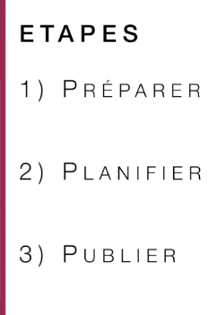

---
hide:
  - toc
---
<figure markdown>
  { width="800" }
  <figcaption>3 Etapes pour mettre en ligne un TP sur MyDocker</figcaption>
</figure>

{ width="150" align=right }

Créer une activité MyDocker et la publier aux étudiants est très simple et se fait en 3 étapes:

- [Etape 1 (:fontawesome-solid-video:)](https://webtv.centralesupelec.fr/permalink/v1263ffe31089x1qdyjc/iframe/#start=59): Préparez votre TP sur votre ordinateur, et transformez-le en fichier Docker, avec l’aide du service informatique au besoin. La plupart du temps il s’agit juste d’adapter l’un des modèles qui existent déjà dans MyDocker
- [Etape 2 (:fontawesome-solid-video:)](https://webtv.centralesupelec.fr/permalink/v1263ffe31089x1qdyjc/iframe/#start=182) : Planifiez les séances en précisant le nombre d’étudiants pour que les serveurs soient automatiquement réservés
- [Etape 3 (:fontawesome-solid-video:)](https://webtv.centralesupelec.fr/permalink/v1263ffe31089x1qdyjc/iframe/#start=259) : Publiez l’activité directement dans Moodle, les étudiants inscrits au cours y auront accès

N’hésitez pas à prendre rendez-vous sur [ce lien](https://calendly.com/support-core/mydocker) pour une présentation de l'outil (30 minutes à 1h), et à envoyer un mail à l’adresse [contact.opensource@centralesupelec.fr](mailto:contact.opensource@centralesupelec.fr) pour toute question.

